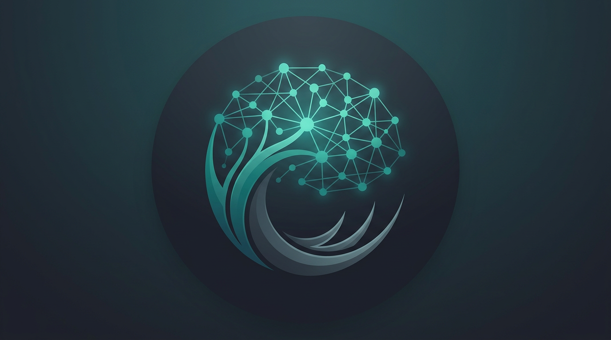

# ClawMind

<p align="center">
  
</p>

<p align="center">
  <strong>本地优先的 AI 对话与 Agent 客户端</strong><br/>
  Go（Gin + SQLite + SSE）· Vue 3（Vite + Pinia + Tailwind）
</p>

<p align="center">
  
  &nbsp;&nbsp;
  
</p>

---

## 简介

ClawMind 提供 **ChatGPT 风格主列**（主区宽度约为侧栏以外区域的 **4/5 / 80%**）、**流式 Markdown**（含表格与代码块复制）、**可折叠的任务流程与思考过程**（Cursor Agent 式分段）、**内置工具 Agent** 与 **项目 / 技能 / 会话** 管理。模型与密钥等保存在 **`.clawmind/config.json`**，也可用环境变量作后备。

**详细文档**见 **[docs/](docs/README.md)**（[特点与能力](docs/features.md)、[架构说明](docs/architecture.md)）。

## 前置条件

- Go 1.22+，**CGO 已启用**，**GCC** 与 **libsqlite3-dev**（Debian/Ubuntu: `sudo apt install build-essential libsqlite3-dev`）
- Node.js 18+（推荐 20+）
- 兼容 OpenAI Chat Completions 的 API（设置中填写 Key，或 `OPENAI_API_KEY`）

## 快速开始

```bash
# 仓库根目录（推荐）
make run
```

或分别启动：

```bash
cd backend
CGO_ENABLED=1 go run ./cmd/server
```

```bash
cd frontend
npm install && npm run dev
```

浏览器访问 **`http://127.0.0.1:5173`**（Vite 将 `/api` 代理到 `:8080`）。

## 品牌资源

| 资源 | 路径 |
|------|------|
| Logo（SVG） | [docs/assets/logo.svg](docs/assets/logo.svg) · 前端 [frontend/public/logo.svg](frontend/public/logo.svg) |
| AI 助手头像（PNG） | [docs/assets/clawmind-assistant.png](docs/assets/clawmind-assistant.png) · `frontend/public/` |
| 用户头像（PNG） | [docs/assets/clawmind-user.png](docs/assets/clawmind-user.png) · `frontend/public/` |

## 后端说明

默认监听 **`:8080`**，数据库 **`./data/clawmind.db`**。配置目录默认为仓库根下 **`.clawmind/`**（从 `backend/` 启动则为 **`../.clawmind/`**），可用 **`CLAWMIND_DIR`** 覆盖。

### 环境变量（节选）

| 变量 | 说明 |
|------|------|
| `OPENAI_API_KEY` / `OPENAI_BASE_URL` / `OPENAI_MODEL` | API 与模型后备 |
| `LISTEN` | 监听地址，默认 `:8080` |
| `DB_PATH` | SQLite 路径 |
| `CLAWMIND_DIR` | `.clawmind` 目录（`config.json`、`skills.json`） |
| `TOOLS_PATH` | 额外工具 JSON，与内置原子工具合并 |
| `AGENT_WORKSPACE` | Agent 文件与 Shell 的工作区根路径 |
| `CLAWMIND_MEMORY_BACKEND` | `sqlite`（默认）或 `memory`（进程内记忆，测试用） |
| `CLAWMIND_EMBEDDING_MODEL` | 非空则启用记忆语义检索（OpenAI 兼容 `embeddings`） |
| `CLAWMIND_MEMORY_SEMANTIC_TOP_K` | 语义检索条数，默认 8 |
| `CLAWMIND_MAX_CONTEXT_TOKENS` | 历史消息估算 token 上限，默认 24000 |
| `CLAWMIND_TOKEN_BUDGET` | 单次回复链路累计 token 软上限，0 不限制 |
| `CLAWMIND_MCP_COMMAND` | MCP stdio 可执行文件（如 `npx`），空则禁用 |
| `CLAWMIND_MCP_ARGS` | 以 `\|` 分隔的参数片段，如 `-y\|@modelcontextprotocol/server-filesystem\|/tmp` |
| `CLAWMIND_MCP_ENV` | 额外环境变量，`KEY=VAL;KEY2=VAL2` |

内置工具：`file_read`、`file_write`、`shell_exec`、`web_fetch`、`task_plan`、`task_summary`。多级内存 **L0–L3** 见 [docs/features.md](docs/features.md)；演进与 MCP/SSE 契约见 [docs/architecture-evolution.md](docs/architecture-evolution.md)。

## API 摘要

- `GET/PUT /api/settings` — `config.json`
- `GET/POST /api/skills`、`POST /api/skills/import` — 技能列表与导入
- `POST/GET/.../api/projects`、`GET/POST/.../api/sessions`、消息与 **SSE 流式** — 详见 [docs/architecture.md](docs/architecture.md)

## Docker Compose（可选）

```bash
docker compose up --build
```

浏览器访问 `http://localhost:8081`。

## 许可证

见 [LICENSE](LICENSE)。
