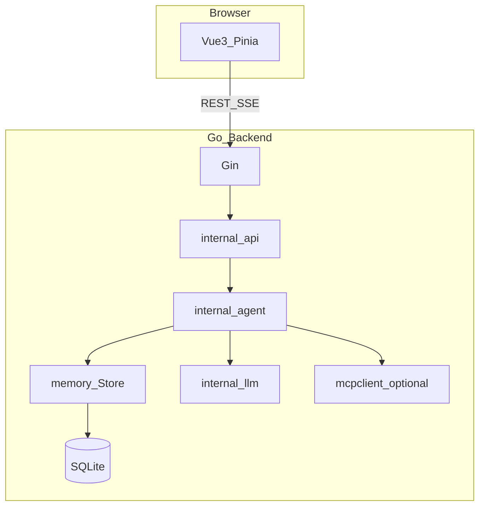

# ClawMind 演进架构与路线图

本文档描述相对 [architecture.md](architecture.md) 当前实现的**目标架构**、与 [content1.md](../content1.md)（技术分析）的差距对照，以及 SSE / MCP 等协议说明。实现细节以代码为准。

## 差距摘要（现状 → 目标）

| 维度 | 现状 | 目标 | 主要模块 |
|------|------|------|----------|
| L1–L3 记忆 | **默认** `SQLiteStore` 持久化；`memory` 后端为进程内 | 继续完善语义检索与裁剪策略；可选与主库分文件 | `internal/memory`, `internal/store` |
| 语义检索 | 子串匹配 | OpenAI 兼容 `embeddings` + 余弦相似度 top-k 注入 system | `internal/llm/embeddings.go`, `memory.SQLiteStore` |
| 反思 | 工具错误字符串直接进入下一轮 | Reflexion：失败时短补全写入上下文（可选写入 L1） | `internal/agent` |
| 高危 Shell | 工作区约束 + 启发式高危 + SSE 确认 | 更强 denylist、超时与文档化沙箱部署建议 | `agent/shell_policy`, `api`, `frontend` |
| 工具生态 | 静态 JSON 合并 | MCP：可选 stdio 子进程客户端，工具合并进 registry | `internal/mcpclient`, `cmd/server` |
| 上下文 | 按助手轮数裁剪 | 估算 token 预算 + 轮数裁剪组合 | `internal/agent/trim.go` |
| 可观测性 | SSE 过程事件；可选 `CLAWMIND_TOKEN_BUDGET` | `slog` 记录 completion usage、工具耗时；速率限制（多用户场景） | `internal/llm`, `internal/api` |

## 目标架构（Mermaid）



## SSE 事件契约（扩展）

在原有 `part_start` / `delta` / `tool_call` / `tool_result` / `done` / `error` 基础上：

| 类型 | 说明 | 关键字段 |
|------|------|----------|
| `tool_approval_request` | 高危 `shell_exec` 需用户确认 | `approvalId`, `sessionId`, `messageId`, `toolCallId`, `toolName`, `arguments`（命令摘要） |
| `tool_approval_result` | 用户已决策（便于 UI 收尾） | `approvalId`, `approved` |

前端收到 `tool_approval_request` 后应调用：

`POST /api/sessions/:id/tool-approval`

请求体 JSON：

```json
{ "approvalId": "<uuid>", "approve": true }
```

- `approve: false` 表示拒绝；后端向模型注入「用户拒绝执行该命令」的工具结果。
- 批准与拒绝均有服务端 TTL（默认 5 分钟），超时视为拒绝。

## MCP 配置

通过环境变量启用（零配置时关闭）：

| 变量 | 说明 |
|------|------|
| `CLAWMIND_MCP_COMMAND` | 可执行文件路径（如 `npx`） |
| `CLAWMIND_MCP_ARGS` | 以竖线 `\|` 分隔的参数片段，例如 `-y\|@modelcontextprotocol/server-filesystem\|/tmp` |
| `CLAWMIND_MCP_ENV` | 可选，`KEY=VAL;KEY2=VAL2` |

启动时若 `CLAWMIND_MCP_COMMAND` 非空，则尝试拉起 MCP stdio 会话并 `tools/list`，将工具定义合并到内置与 JSON 技能之后。MCP 工具调用通过同一 JSON-RPC 会话转发；失败时服务仍可启动（仅内置工具）。

## 环境变量速查

| 变量 | 说明 |
|------|------|
| `CLAWMIND_MEMORY_BACKEND` | `sqlite`（默认，与主库同文件）或 `memory`（进程内，测试用） |
| `CLAWMIND_EMBEDDING_MODEL` | 非空则对记忆写入 embedding 并在检索时使用语义 top-k（需有效 API Key） |
| `CLAWMIND_MEMORY_SEMANTIC_TOP_K` | 语义检索条数，默认 8 |
| `CLAWMIND_MAX_CONTEXT_TOKENS` | 发送给模型的历史估算 token 上限，默认 24000 |
| `CLAWMIND_TOKEN_BUDGET` | 单次 RunStream 累计 completion token 软上限，0 表示不限制 |
| `CLAWMIND_MCP_*` | 见上节 |

## 分阶段路线图

1. **记忆持久化**：`agent_memory` 表 + `SQLiteStore`，默认启用。
2. **RAG 最小闭环**：Embedding API + 向量落库 + `RetrieveLevels` 语义分支。
3. **Reflexion**：工具失败后的补全注入。
4. **Shell 确认**：SSE + REST + 前端 `confirm`。
5. **MCP**：stdio 客户端与工具合并。
6. **上下文与成本**：token 估算裁剪 + usage 日志 + 可选 budget。

## 风险说明

- **SQLite**：使用 `modernc.org/sqlite` 纯 Go 驱动，默认无需 CGO，便于交叉编译与精简镜像。
- **Embedding 成本**：每条记忆写入会调用一次 embedding API（可仅在生产开启 `CLAWMIND_EMBEDDING_MODEL`）。
- **SSE 阻塞**：人机确认会阻塞 Agent 循环直至 POST；断连时以取消上下文为准。
