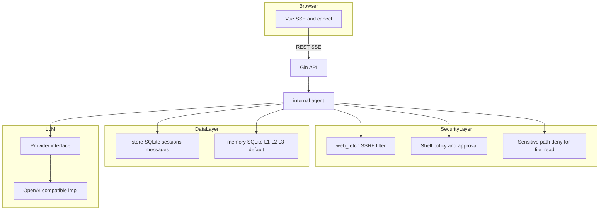

# ClawMind 目标架构与安全边界

本文档描述项目在安全性、数据层、LLM 适配与前端流式交互上的**目标形态**与边界约定。实现以代码为准；与 [architecture.md](architecture.md)（当前模块划分）及 [architecture-evolution.md](architecture-evolution.md)（路线图）配合阅读。

## 总览

## 安全边界

| 能力 | 目标行为 |
|------|----------|
| `web_fetch` | 仅允许 `http`/`https`；拒绝私网、链路本地、云元数据等 SSRF 目标；解析后的 IP 在连接前校验。 |
| `shell_exec` | 非沙箱执行：命中 **denylist** 的命令一律拒绝；其余高危模式经 SSE `tool_approval_request` 与用户 REST 确认后再执行。单次子进程超时 **60s**，合并输出上限见代码。生产环境建议：专用 Linux 用户、只读根文件系统、Docker/`gVisor`/seccomp 等进一步隔离（需自行编排）。 |
| `file_read` / `file_write` | 路径限制在 `AGENT_WORKSPACE` 下；禁止读取配置目录中的密钥文件（如 `.clawmind/config.json`）。 |
| 密钥存储 | 优先使用环境变量（如 `OPENAI_API_KEY`）；配置文件中的 Key 仅本地使用且勿提交版本库；Agent 工具链不应能读取该文件。 |

## 数据层

- **会话与消息**：SQLite（`internal/store`），与主应用同库文件（`DB_PATH`）。
- **L1–L3 记忆**：默认 **SQLite**（`internal/memory/sqlite_store.go`），与主库共用连接；环境变量 `CLAWMIND_MEMORY_BACKEND=memory` 时使用进程内存储（测试或特殊场景）。
- **可选演进**：多租户或大规模部署时可引入 PostgreSQL；当前单用户本地优先以 SQLite 为主。

## LLM 适配层

- **当前**：OpenAI 兼容 `POST /v1/chat/completions`（流式与非流式）。
- **目标**：`internal/llm` 内定义窄接口（Complete / Stream），默认实现为 OpenAI 兼容；后续可挂载 Anthropic、Gemini 等原生协议而无需改动 Agent 编排。

## 前端与 SSE

- **连接**：`GET /api/sessions/:id/stream?messageId=` 建立 `text/event-stream`。
- **取消**：后端使用可取消的 Context（`genCtx`）；客户端断开或调用 `POST /api/sessions/:id/messages/:mid/cancel` 应触发取消，停止 LLM 与工具循环。
- **重连（目标）**：网络闪断后可基于已持久化消息与 `Last-Event-ID` 或自定义游标做续传，避免重复或丢失（逐步实现）。

## 成本与轮次

- `maxAgentRounds`：工具调用轮次上限；耗尽时应向用户返回明确说明。
- `CLAWMIND_TOKEN_BUDGET`：单次 `RunStream` 的 completion token 软上限（0 表示不限制）。

## 技能生态

- **当前**：OpenAI tools 形状的 JSON，经 `.clawmind/skills.json` 与 `TOOLS_PATH` 合并。
- **与 OpenClaw 差异**：OpenClaw 生态常用 `SKILL.md` 与注册中心；长期可考虑解析 `SKILL.md` 或对接社区注册源，详见 [skills-roadmap.md](skills-roadmap.md)。
