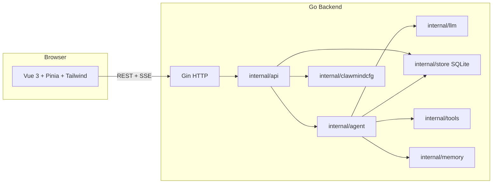

# ClawMind 架构说明

## 总览

## 技术栈

| 层级 | 技术 |
|------|------|
| 前端 | Vue 3、Vite、TypeScript、Pinia、Tailwind CSS、markdown-it、markdown-it-multimd-table（表格）、highlight.js |
| 后端 | Go 1.22+、Gin、SQLite（mattn/go-sqlite3，需 CGO） |
| 协议 | REST JSON、SSE（`text/event-stream`）承载流式事件 |

## 目录与模块（后端）

| 路径 | 职责 |
|------|------|
| `cmd/server` | 入口：环境变量、`CLAWMIND_DIR`、数据库路径、路由注册 |
| `internal/api` | HTTP 处理器：会话、消息、流、设置、项目、技能 |
| `internal/agent` | 编排：任务/思考流式段、工具循环、最终流式回答、记忆写入 |
| `internal/llm` | OpenAI 兼容 `chat/completions`：流式与非流式、消息与 tools 载荷 |
| `internal/clawmindcfg` | `.clawmind/config.json` 读写与解析、环境变量兜底 |
| `internal/store` | SQLite：sessions、messages、projects |
| `internal/tools` | 工具定义合并：内置 + 文件 + skills.json |
| `internal/memory` | 分层内存接口与进程内实现 |

## 目录与模块（前端）

| 路径 | 职责 |
|------|------|
| `src/stores/chat.ts` | 会话列表、消息、SSE 解析、流式分段缓冲、项目与技能 API |
| `src/components/ChatMessage.vue` | 用户/助手布局、折叠块、Markdown 区 |
| `src/components/MarkdownMessage.vue` | Markdown 渲染与代码块复制 |
| `src/components/Composer.vue` | 输入与发送/停止 |
| `public/` | 静态资源：`logo.svg`、头像 PNG |

## 一次发送消息的数据流

1. `POST /api/sessions/:id/messages` 写入用户消息并创建 **占位助手消息**。
2. 前端 `GET /api/sessions/:id/stream?messageId=...` 建立 SSE。
3. `agent.RunStream`：
   - 流式输出 **任务流程**、**思考**（各为独立 `partIndex`）；
   - `Complete` + 工具执行循环（若有）；
   - 最后对 **正文** 再 `StreamChat`，增量写回 SQLite 并推送 `delta`。
4. 事件类型见 `internal/domain` 中 `StreamEvent`（`part_start` / `delta` / `part_end` / `tool_call` / `tool_result` / `done` / `error`）。

## 配置与环境

- **`CLAWMIND_DIR`**：配置根目录；未设置时，在 `backend/` 下启动则指向 `../.clawmind`。
- **`TOOLS_PATH`**：额外工具 JSON，相对后端进程工作目录。
- **`AGENT_WORKSPACE`**：Agent 文件与 Shell 的根路径。

## 构建与运行

- 后端：`CGO_ENABLED=1 go run ./cmd/server`（或根目录 `make run`）。
- 前端：`npm run dev`，Vite 将 `/api` 代理到后端。

更详细的运行方式见根目录 [README.md](../README.md)。
